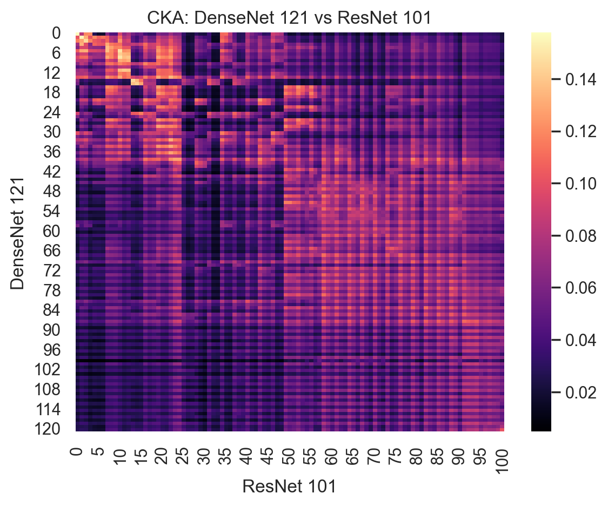

# simtorch

[](https://pepy.tech/project/simtorch)

A Pytorch library to measure the similarity between two neural network representations. The library currently supports the following (dis)similarity measures:

* Centered Kernel Alignment (CKA) - [Kornblith, et al, ICML 2019](http://proceedings.mlr.press/v97/kornblith19a.html)
* Deconfounded CKA - [Cui, et al, NeurIPS 2022](https://openreview.net/pdf?id=mMdRZipvld2)
* Procrustes [WIP]
* CCA [WIP]


## Design

The package consists of two components -

* `SimilarityModel` - which is a thin wrapper on `torch.nn.Module()` which adds forwards hooks to store the layer-wise activations (aka representations) in a dictionary.
* `BaseSimilarity` - which sets the interface for classes that compute similarity between network representations

## Installation

The package is indexed by pypi

```
pip install simtorch
```

## Usage

The torch model objects need to be wrapped with `SimilarityModel`. A list of names of the layers we wish to compute the representations is passed as an attribute to this class.

```
model1 = torchvision.models.densenet121()
model2 = torchvision.models.resnet101()

sim_model1 = SimilarityModel(
    model1,
    model_name="DenseNet 121",
    layers_to_include=["conv", "classifier",]
)

sim_model2 = SimilarityModel(
    model2,
    model_name="ResNet 101",
    layers_to_include=["conv", "fc",]
)
```

An instance of a similarity metric can then be initialized with these `SimilarityModel`s. The `compute()` method can be used to obtain a similarity matrix $S$ for these two models where $S[i, j]$ is the similarity metric for the $i^{th}$ layer of the first model and the $j^{th}$ layer of the second model.

```
sim_cka = CKA(sim_model1, sim_model2, device="cuda")
cka_matrix = sim_cka.compute(torch_dataloader)
```

The similarity matrix can be visualized using the `sim_cka.plot_similarity()` method to obtain the CKA similarity plot




## Citations

If you use Deconfounded Centered Kernel Alignment (dCKA) for your research, please cite:

```
@article{cui2022deconfounded,
  title={Deconfounded Representation Similarity for Comparison of Neural Networks},
  author={Cui, Tianyu and Kumar, Yogesh and Marttinen, Pekka and Kaski, Samuel},
  journal={Neural Information Processing Systems (NeurIPS)},
  year={2022}
}
```

## Credits

This has been built by using the following awesome repos as reference:

* [anatome](https://github.com/moskomule/anatome), maintained by [@moskomule](https://github.com/moskomule)
* [Pytorch-Model-Compare](https://github.com/AntixK/PyTorch-Model-Compare), maintained by [@AntixK](https://github.com/AntixK)
* [centered-kernel-alignment](https://github.com/Kennethborup/centered_kernel_alignment), maintained by [@Kennethborup](https://github.com/Kennethborup)

